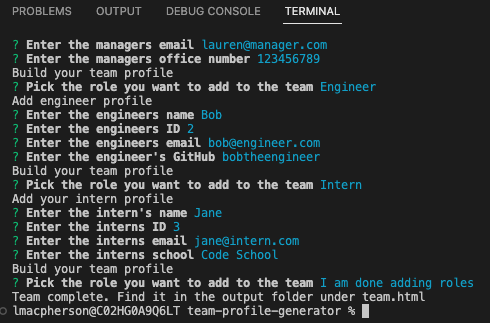
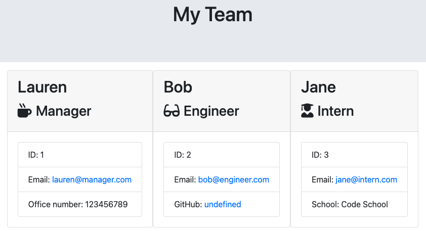

# Team Profile Generator

## A simple command line application for generating a Team profile using an employee class with extensions for Manager, Engineer and Intern. This package uses Inquirer and Jest.

<!-- TABLE OF CONTENTS -->
  

    
Table of Contents

    <ol>
          <li><a href="#about-the-project">About The Project</a></li>
          <li><a href="#deployment">Deployment / Code Repository</a></li>
          <li><a href="#screenshot">Screenshot</a></li>
          <li><a href="#user-story-&-acceptance-criteria">User Story & Acceptance Criteria</a></li>
          <li><a href="#usage">Usage</a></li>
          <li><a href="#questions">Questions</a></li>
          <li><a href="#license">License</a></li>
        </ol>
  

  <!-- About the Project -->

## About the Project

### Deployment / Code Repository

[Live Deployment](https://maclauren.github.io/team-profile-generator/)

[Repository](https://github.com/maclauren/team-profile-generator)

### Screenshots

App:

Team Profile Page:

### User Story & Acceptance Criteria

AS A manager
I WANT to generate a webpage that displays my team's basic info
SO THAT I have quick access to their emails and GitHub profiles

1) Create a command-line application that accepts user input using the provided starter code.
2) Create classes for each team member provided and export them. The tests for these classes, which are located in the _tests_ directory, must ALL pass.
3) The first class is an Employee parent class with the following properties and methods:

name

id

email

getName()

getId()

getEmail()

getRole()—returns 'Employee'

The other three classes will extend Employee.

4) In addition to Employee's properties and methods, Manager will also have the following:

officeNumber

getRole()—overridden to return 'Manager'

5) In addition to Employee's properties and methods, Engineer will also have the following:

github—GitHub username

getGithub()

getRole()—overridden to return 'Engineer'

6) In addition to Employee's properties and methods, Intern will also have the following:

school

getSchool()

getRole()—overridden to return 'Intern'

7) Write code in index.js that uses Inquirer to gather information about the development team members and creates objects for each team member using the correct classes as blueprints.

8) When a user starts the application, they're prompted to enter the team manager's:

Name

Employee ID

Email address

Office number

9) When a user enters those requirements, the user is presented with a menu with the option to:

Add an engineer

Add an intern

Finish building the team

10) When a user selects the engineer option, the user is prompted to enter the following and then taken back to the menu:

Engineer's Name

ID

Email

GitHub username

11) When a user selects the intern option, the user is prompted to enter the following and then taken back to the menu:

Intern’s name

ID

Email

School

12) When a user decides to finish building their team, they exit the application and the HTML is generated.

13) Call the render function (provided for you) and pass in an array containing all employee objects. The render function will generate and return a block of HTML including templated div elements for each employee.

14) Create an HTML file using the HTML returned from the render function. Write it to a file named team.html in the output folder. You can use the provided variable outputPath to target this location.

### Usage

You should have Node.js, Jest and Inquirer installed.

### Questions

If you have any questions, please [email me](mailto:laurenmacpherson@hotmail.co.uk?subject=team-profile-generator)

You can find more of my work at https://github.com/maclauren

### License

MIT License

Copyright (c) 2023 maclauren